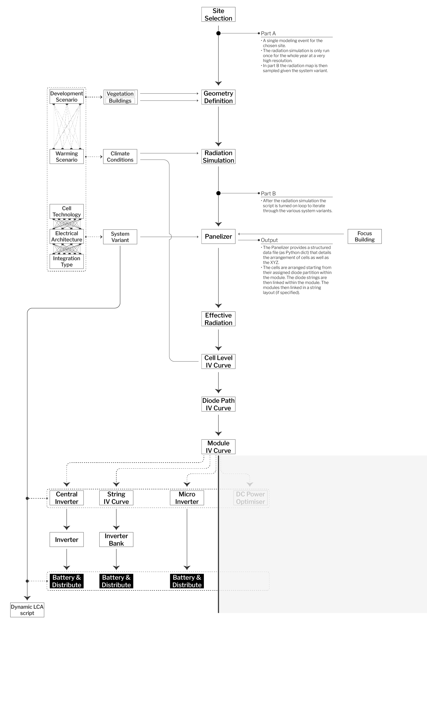

# IPV_Workbench

A Python-based set of tools and workflows for analysing integrated photovotlaic arrays. The repository provides a set of established workflows to move from low level of detail geometry and descriptive data through the automatic design of an array and the IV-based calculation of that array.

The workflows can also be partioned easily to work with only certain aspects of the workbench such as the IPV performance model or the array panelizer scripts.

